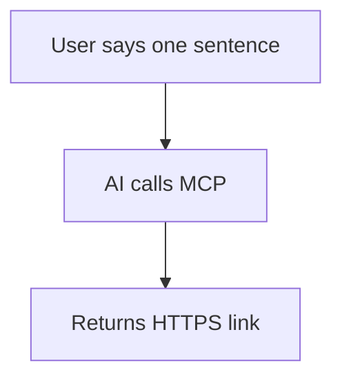

<p align="center">
  <a href="README.md">中文</a> &nbsp;·&nbsp;
  <a href="README.en.md">English</a>
</p>

<p align="center">
  
</p>

<h3 align="center">PageFire</h3>

<p align="center">
  Give AI a "publish" button — one sentence, content goes live on its own HTTPS subdomain in seconds<br>
  Self-hosted &nbsp;·&nbsp; Multi-tenant &nbsp;·&nbsp; MCP-native &nbsp;·&nbsp; Zero deploy workflow
</p>

<p align="center">
  <a href="https://pagefire.openhkt.com"><b>Live Demo</b></a> &nbsp;·&nbsp;
  <a href="packages/mcp-client/README.md">CLI Docs</a> &nbsp;·&nbsp;
  <a href="docs/DEPLOY.md"><b>中文版</b></a> &nbsp;·&nbsp;
  <a href="https://www.npmjs.com/package/pagefire-mcp">npm</a>
</p>

<p align="center">
  <a href="https://github.com/bradyliuY/page-fire/actions/workflows/ci.yml">
    
  </a>
  <a href="https://www.npmjs.com/package/pagefire-mcp">
    
  </a>
  <a href="https://www.npmjs.com/package/pagefire-mcp">
    
  </a>
  <a href="LICENSE">
    
  </a>
  
</p>

---

> Give Claude, Cursor, and other AI clients a superpower: right from the chat, one sentence turns your content into a live HTTPS page on its own subdomain — done in seconds, no deploy tooling required.
>
> Try the hosted version: **[pagefire.openhkt.com](https://pagefire.openhkt.com)** (sign up, get an API key) &nbsp;·&nbsp; Or self-host on your own server.

<p align="center">
  <a href="https://pagefire.openhkt.com">
    
  </a>
</p>

---

## Key Features

- **MCP-native** — 10 MCP tools so AI can publish HTML / Markdown / ZIP / entire directories in a single chat message
- **Instant publish** — sub-second turnaround, returns a shareable HTTPS subdomain link automatically
- **Markdown rendering** — full GFM, including Callout alerts, Mermaid diagrams, code language labels, collapsible sections
- **Multi-page docs** — `deploy_docs_dir` generates a full documentation site with sidebar nav + per-page table of contents
- **Directory deploy** — `deploy_dir` supports `.pagefireignore` files and `exclude` patterns (`.gitignore`-style)
- **Access control** — public or password-protected, switchable at any time
- **Lifecycle management** — 7-day default expiry, pin permanently, or delete anytime
- **Pure static hosting** — server never executes user code; security isolation by design
- **Self-hosted** — runs on your own Linux server, full data control

---

## Quick Start

### Prerequisites

- Node.js ≥ 20 + pnpm
- Linux server (nginx handles TLS termination; co-exists with existing services)
- Domain + wildcard DNS (`*.pagefire.yourdomain.com A <server-ip>`)

### Install & Start

```bash
git clone https://github.com/bradyliuY/page-fire.git
cd page-fire
pnpm install
pnpm build
node scripts/download-mermaid.mjs   # download mermaid for offline Markdown charts
cp .env.example .env                # edit .env with your domain etc.
pnpm start
```

### Environment Variables

| Variable | Description | Default |
|----------|-------------|---------|
| `PAGEFIRE_DB` | SQLite database path | `./dev-data/pagefire.db` |
| `PAGEFIRE_SITES` | Static file storage directory | `./dev-data/sites` |
| `PAGEFIRE_HTTP_PORT` | HTTP static service port | `4000` |
| `PAGEFIRE_MCP_PORT` | MCP service port | `4100` |
| `PAGEFIRE_BASE_DOMAIN` | Base domain | `localhost` |
| `PAGEFIRE_TOKEN_ENC_KEY` | 64-char hex encryption key (must change) | — |

### Create a Token

```bash
node dist/cli/index.js token create --slug mytoken --label "My space"
node dist/cli/index.js token list
```

For the full deployment guide (DNS / wildcard cert / nginx / PM2), see [docs/DEPLOY.md](docs/DEPLOY.md) (Chinese).

---

## Usage

PageFire has three modes, all sharing the same API key:

- **Web Console** — Zero-config in the browser, sign up and use, great for manual publishing & management. Visit the root domain.
- **CLI** — `pagefire deploy` from your terminal or CI pipeline, great for automation.
- **MCP Client** — Publish from your chat in Claude / Cursor — ideal for AI workflows.

---

## CLI (Terminal / CI)

The `pagefire-mcp` npm package provides the `pagefire` command:

```bash
# Global install (one-time, always available)
npm install -g pagefire-mcp

# Or run without installing (handy for CI)
npx pagefire-mcp <command>
```

```bash
export PAGEFIRE_TOKEN=pf_your_token

pagefire deploy ./dist              # Deploy a directory
pagefire deploy README.md           # Deploy Markdown (auto-rendered)
pagefire deploy-docs ./docs --pin   # Deploy a multi-page doc site
pagefire list                       # List all deployments
pagefire pin mysite                 # Pin permanently
pagefire delete mysite              # Delete
```

Common options: `--did=<id>` (custom ID, overwrites existing) `--pin` (permanent) `--spa` (SPA mode) `--theme=dark`

Full CLI docs at [packages/mcp-client/README.md](packages/mcp-client/README.md).

---

## MCP Client (AI Chat)

### Connect Your MCP Client

**Option 1: npm connector (recommended)**

```json
{
  "mcpServers": {
    "pagefire": {
      "command": "npx",
      "args": ["-y", "pagefire-mcp@latest"],
      "env": { "PAGEFIRE_TOKEN": "pf_your_token_here" }
    }
  }
}
```

**Option 2: HTTP direct**

```json
{
  "mcpServers": {
    "pagefire": {
      "type": "http",
      "url": "https://mcp.pagefire.yourdomain.com/mcp",
      "headers": { "Authorization": "Bearer pf_your_token_here" }
    }
  }
}
```

> If HTTP direct gives you a **Failed to connect** error (common with the Bun runtime or corporate DPI), switch to Option 1 — the npm connector proxies through your local Node.js and bypasses fingerprint blocking.

Once configured, just chat:

```
Turn this product intro into a webpage and pin it permanently.
Package this React app as a ZIP, deploy it with SPA mode.
Turn docs/ into a multi-page documentation site, dark theme.
```

---

## MCP Tools

| Tool | Description |
|------|-------------|
| `deploy_page` | Publish a single HTML string |
| `deploy_markdown` | Publish Markdown (auto-rendered, Mermaid / Callout supported) |
| `deploy_docs_dir` | Publish local Markdown directory → multi-page docs site |
| `deploy_dir` | Publish a local directory (supports `.pagefireignore`) |
| `deploy_files` | Publish a multi-file site (index.html + assets) |
| `deploy_zip` | Publish a ZIP archive (base64-encoded) |
| `list_deployments` | List all deployments |
| `get_deployment` | View deployment details |
| `pin_deployment` | Pin a deployment permanently |
| `delete_deployment` | Delete a deployment |
| `set_access` | Toggle public/password protection |

---

## Markdown Features

`deploy_markdown` and `deploy_docs_dir` support full GFM, plus these extras:

**Callout alerts** (GitHub / Obsidian style)

```markdown
> [!NOTE]   Note
> [!TIP]    Tip
> [!WARNING]   Warning
> [!IMPORTANT]  Important
> [!ABSTRACT]  Abstract
> [!EXAMPLE]  Example
> [!QUOTE]   Quote
```

**Mermaid diagrams** (self-hosted, no external CDN)

````markdown

````

**Other**: code language labels, `<mark>` highlights, `<kbd>` keys, `<details>` collapse, task list checkboxes.

Three themes: `light` (default), `dark`, `sepia`.

---

## Development

```bash
pnpm test             # Run all tests
pnpm test:unit        # Unit tests only
pnpm test:integration # Integration tests only
pnpm dev              # tsx watch dev mode
```

### Project Structure

```
src/
├── index.ts          # Entry point (MCP + HTTP in one process)
├── config.ts         # Environment variable loader
├── cli/              # CLI commands (token management, gc)
├── core/             # Business logic (publish, validation, zip, markdown)
├── db/               # SQLite layer (schema, repo, migration)
├── http/             # HTTP static server, dashboard, REST API
└── mcp/              # MCP server & tool definitions
packages/
└── mcp-client/       # pagefire-mcp npm connector package
```

---

## Security

- **Server never executes user code**: HTML/JS runs only in the visitor's browser
- **Token keys never appear in URLs**: domains use opaque random `space_id` mappings; DB stores only hashes
- **Atomic uploads**: write tmp → validate (path traversal / Zip Slip / zip bomb / SVG sanitize) → rename
- **MCP binding on 127.0.0.1**: only exposed through nginx proxy with mandatory Bearer auth

Architecture & security model at [docs/design.md](docs/design.md) (Chinese).

---

## License

MIT © [OpenHKT](https://github.com/bradyliuY) — unrestricted use for self-hosting.

Commercial multi-tenant cloud service (you are the operator, your users are tenants) requires a commercial license, see [LICENSE.COMMERCIAL](LICENSE.COMMERCIAL).
