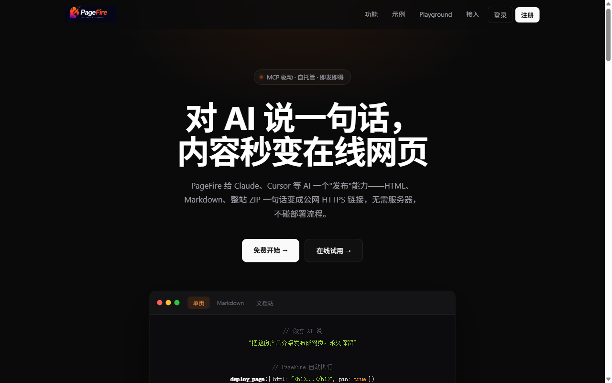
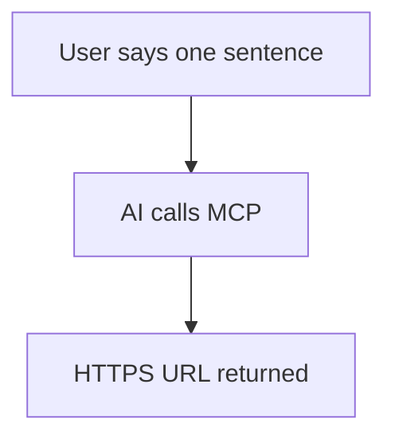

<p align="center">
  <a href="README.md">中文</a> &nbsp;·&nbsp;
  <a href="README.en.md">English</a>
</p>

<p align="center">
  
</p>

<h3 align="center">PageFire</h3>

<p align="center">
  Give AI a "publish" superpower — one sentence, and your content becomes an HTTPS subdomain page in seconds<br>
  Self-hosted &nbsp;·&nbsp; Multi-tenant &nbsp;·&nbsp; MCP-native &nbsp;·&nbsp; Zero deploy workflow
</p>

<p align="center">
  <a href="https://pagefire.openhkt.com"><b>Live Demo</b></a> &nbsp;·&nbsp;
  <a href="packages/mcp-client/README.md">CLI Docs</a> &nbsp;·&nbsp;
  <a href="docs/DEPLOY.md">Deploy Guide</a> &nbsp;·&nbsp;
  <a href="https://www.npmjs.com/package/pagefire-mcp">npm</a>
</p>

<p align="center">
  <a href="https://github.com/bradyliuY/page-fire/actions/workflows/ci.yml">
    
  </a>
  <a href="https://www.npmjs.com/package/pagefire-mcp">
    
  </a>
  <a href="https://www.npmjs.com/package/pagefire-mcp">
    
  </a>
  <a href="LICENSE">
    
  </a>
  
</p>

---

> Give Claude, Cursor, and other AI clients a "publish" superpower — right from the chat, one sentence turns your content into a live HTTPS subdomain page in seconds, with zero deploy overhead.
>
> **Use the hosted version directly at [pagefire.openhkt.com](https://pagefire.openhkt.com)** (register and get an API Key), or self-host on your own server.

<p align="center">
  <a href="https://pagefire.openhkt.com">
    
  </a>
</p>

---

## Key Features

- **MCP-native**: 10 MCP tools — publish HTML, Markdown, ZIP, or an entire directory with one sentence in an AI conversation
- **Instant publish**: Ready in seconds with an auto-generated shareable HTTPS subdomain URL
- **Markdown rendering**: Full GFM support with Callout blocks, Mermaid diagrams, code language labels, collapsible sections, and more
- **Multi-page docs**: `deploy_docs_dir` generates a full documentation site with left sidebar navigation and per-page table of contents
- **Directory deploy**: `deploy_dir` supports `.pagefireignore` files and `exclude` parameters (`.gitignore`-style)
- **Access control**: Public or password-protected, switchable at any time
- **Lifecycle management**: Default 7-day expiry, can be pinned permanently, delete anytime
- **Pure static hosting**: Server never executes user code — secure isolation by design
- **Self-hosted**: Run on your own Linux server with full data control

---

## Quick Start

### Prerequisites

- Node.js ≥ 20 + pnpm
- Linux server (nginx handles TLS termination; co-exists with existing services)
- Domain name + wildcard DNS (`*.pagefire.yourdomain.com A <server-ip>`)

### Install & Launch

```bash
git clone https://github.com/bradyliuY/page-fire.git
cd page-fire
pnpm install
pnpm build
node scripts/download-mermaid.mjs   # Download mermaid for offline Markdown diagrams
cp .env.example .env                # Edit .env with your domain and config
pnpm start
```

### Environment Variables

| Variable | Description | Default |
|----------|-------------|---------|
| `PAGEFIRE_DB` | SQLite database path | `./dev-data/pagefire.db` |
| `PAGEFIRE_SITES` | Static file storage directory | `./dev-data/sites` |
| `PAGEFIRE_HTTP_PORT` | HTTP static service port | `4000` |
| `PAGEFIRE_MCP_PORT` | MCP service port | `4100` |
| `PAGEFIRE_BASE_DOMAIN` | Base domain | `localhost` |
| `PAGEFIRE_TOKEN_ENC_KEY` | 64-char hex encryption key (must change) | — |

### Create a Token

```bash
node dist/cli/index.js token create --slug mytoken --label "My Space"
node dist/cli/index.js token list
```

For the full deployment guide (DNS / wildcard certs / nginx / PM2), see [docs/DEPLOY.md](docs/DEPLOY.md) (Chinese).

---

## Usage

PageFire offers three usage modes, all sharing the same API Key:

- **Web Console** — zero-config browser interface, register and use. Great for manual publishing and management. Visit the root domain.
- **CLI** — run `pagefire deploy` directly in terminal or CI scripts. Perfect for automation pipelines.
- **MCP Client** — publish with one sentence in Claude, Cursor, or other AI conversations. Ideal for AI workflows.

---

## CLI (Terminal / CI)

The `pagefire` command is provided by the `pagefire-mcp` npm package:

```bash
# Install globally (one-time, always available)
npm install -g pagefire-mcp

# Or run without installing (handy for CI)
npx pagefire-mcp <command>
```

```bash
export PAGEFIRE_TOKEN=pf_your_token

pagefire deploy ./dist              # Deploy a directory
pagefire deploy README.md           # Deploy Markdown (auto-rendered)
pagefire deploy-docs ./docs --pin   # Deploy multi-page docs site
pagefire list                       # List all deployments
pagefire pin mysite                 # Pin permanently
pagefire delete mysite              # Delete a deployment
```

Common options: `--did=<id>` (custom ID, overwrite on re-deploy), `--pin` (permanent), `--spa` (SPA mode), `--theme=dark`

Full CLI reference at [packages/mcp-client/README.md](packages/mcp-client/README.md).

---

## MCP Client (AI Chat)

### Connect Your MCP Client

**Option 1: npm connector (recommended)**

```json
{
  "mcpServers": {
    "pagefire": {
      "command": "npx",
      "args": ["-y", "pagefire-mcp@latest"],
      "env": { "PAGEFIRE_TOKEN": "pf_your_token_here" }
    }
  }
}
```

**Option 2: Direct HTTP**

```json
{
  "mcpServers": {
    "pagefire": {
      "type": "http",
      "url": "https://mcp.pagefire.yourdomain.com/mcp",
      "headers": { "Authorization": "Bearer pf_your_token_here" }
    }
  }
}
```

> If direct HTTP fails with **Failed to connect** (common with the Bun runtime or corporate DPI networks), switch to Option 1 — the npm connector proxies through local Node.js, bypassing fingerprint inspection.

Once configured, just say it in conversation:

```
Publish this product intro as a webpage and pin it permanently.
Package this React app as a ZIP and deploy with SPA mode.
Turn the docs/ directory into a multi-page documentation site, dark theme.
```

---

## MCP Tool Reference

| Tool | Description |
|------|-------------|
| `deploy_page` | Publish a single HTML string |
| `deploy_markdown` | Publish Markdown (auto-rendered, supports Mermaid / Callout) |
| `deploy_docs_dir` | Publish a local Markdown directory → multi-page docs site |
| `deploy_dir` | Publish a local directory (supports `.pagefireignore`) |
| `deploy_files` | Publish a multi-file site (index.html + assets) |
| `deploy_zip` | Publish a ZIP archive (base64 encoded) |
| `list_deployments` | List all deployments |
| `get_deployment` | View deployment details |
| `pin_deployment` | Pin a deployment as permanent |
| `delete_deployment` | Delete a deployment |
| `set_access` | Toggle public / password protection |

---

## Markdown Features

`deploy_markdown` and `deploy_docs_dir` support full GFM with these additional enhancements:

**Callout blocks** (GitHub / Obsidian style)

```markdown
> [!NOTE]    Notes
> [!TIP]     Tips
> [!WARNING]  Warnings
> [!IMPORTANT] Important
> [!ABSTRACT] Abstract
> [!EXAMPLE]  Example
> [!QUOTE]    Quote
```

**Mermaid diagrams** (self-hosted, no external CDN dependency)

````markdown

````

**Other features**: code language labels, `<mark>` highlight, `<kbd>` keys, `<details>` collapsible sections, task list checkboxes.

Three themes: `light` (default), `dark`, `sepia`.

---

## Development

```bash
pnpm test             # Run all tests
pnpm test:unit        # Unit tests only
pnpm test:integration # Integration tests only
pnpm dev              # tsx watch development mode
```

### Project Structure

```
src/
├── index.ts          # Process entry (MCP + HTTP in one process)
├── config.ts         # Environment variable config
├── cli/              # CLI commands (token management, gc)
├── core/             # Core business logic (deploy, validate, zip, markdown rendering)
├── db/               # SQLite data layer (schema, repo, migrate)
├── http/             # HTTP static service, dashboard, REST API
└── mcp/              # MCP Server and tool definitions
packages/
└── mcp-client/       # pagefire-mcp npm connector package
```

---

## Security

- **Server never executes user code**: HTML/JS only runs in the visitor's browser
- **Token keys never appear in URLs**: Domains use opaque random `space_id` mappings; DB stores only hashes
- **Atomic uploads**: write to tmp → validate (path traversal / Zip Slip / zip bomb / SVG sanitize) → rename
- **MCP bound to 127.0.0.1**: Only exposed through nginx reverse proxy; mandatory Bearer auth

Architecture and security model at [docs/design.md](docs/design.md) (Chinese).

---

## License

MIT © [OpenHKT](https://github.com/bradyliuY) — Unlimited use for self-hosting.

Providing a commercial multi-tenant cloud service based on this project (i.e., you are the operator, your users are the tenants) requires a commercial license. See [LICENSE.COMMERCIAL](LICENSE.COMMERCIAL).
