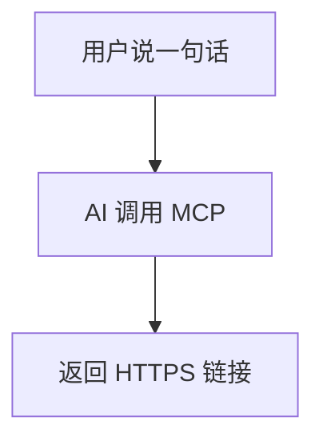

# PageFire

[](https://github.com/bradyliuY/page-fire/actions/workflows/ci.yml)
[](https://www.npmjs.com/package/pagefire-mcp)
[](LICENSE)

> 通过 MCP 一键把 HTML / Markdown / 静态包发布成公网可访问网页的**自托管**静态发布服务。

给 Claude、Cursor 等 AI 客户端一个"发布"能力——对话中一句话，内容立刻变成带 HTTPS 链接的独立子域名页面，几秒完成，全程不碰部署流程。

**在线体验：[pagefire.openhkt.com](https://pagefire.openhkt.com)**

---

## 核心特性

- **MCP 原生**：10 个 MCP 工具，AI 对话中一句话发布 HTML / Markdown / ZIP / 整目录
- **即发即得**：秒级完成，自动返回可分享的 HTTPS 子域名链接
- **Markdown 渲染**：完整 GFM 支持，含 Callout 提示框、Mermaid 图表、代码语言标签、折叠区块等
- **多文档站**：`deploy_docs_dir` 一键生成带左导航 + 右侧 TOC 的多页文档站
- **目录发布**：`deploy_dir` 支持 `.pagefireignore` 文件与 `exclude` 参数，类似 `.gitignore`
- **访问控制**：公开或口令保护，支持动态切换
- **生命周期管理**：默认 7 天过期，可 pin 为永久，可随时删除
- **纯静态托管**：服务端永不执行用户代码，安全隔离
- **自托管**：运行在你自己的 Linux 服务器，数据完全自控

---

## 快速开始

### 前置要求

- Node.js ≥ 20 + pnpm
- Linux 服务器（nginx 负责 TLS 终止；与已有服务共存）
- 域名 + 通配 DNS 解析（`*.pagefire.yourdomain.com A <server-ip>`）

### 安装与启动

```bash
git clone https://github.com/bradyliuY/page-fire.git
cd page-fire
pnpm install
pnpm build
node scripts/download-mermaid.mjs   # 下载 mermaid（Markdown 图表自托管）
cp .env.example .env                # 编辑 .env 填写域名等配置
pnpm start
```

### 环境变量

| 变量 | 说明 | 默认值 |
|------|------|--------|
| `PAGEFIRE_DB` | SQLite 数据库路径 | `./dev-data/pagefire.db` |
| `PAGEFIRE_SITES` | 静态文件存储目录 | `./dev-data/sites` |
| `PAGEFIRE_HTTP_PORT` | HTTP 静态服务端口 | `4000` |
| `PAGEFIRE_MCP_PORT` | MCP 服务端口 | `4100` |
| `PAGEFIRE_BASE_DOMAIN` | 基础域名 | `localhost` |
| `PAGEFIRE_TOKEN_ENC_KEY` | 64 位 hex 加密密钥（必须修改） | — |

### 创建 Token

```bash
node dist/cli/index.js token create --slug mytoken --label "我的空间"
node dist/cli/index.js token list
```

完整部署指南（DNS / 通配证书 / nginx / PM2）见 [docs/DEPLOY.md](docs/DEPLOY.md)。

---

## 使用方式

PageFire 有三种用法，共用同一套 API Key：

- **Web 控制台** —— 浏览器零配置，注册即用，适合手动发布与管理。访问根域名即可。
- **CLI** —— 终端 / CI 脚本中直接 `pagefire deploy`，适合自动化流水线。
- **MCP 客户端** —— 在 Claude / Cursor 等对话中一句话发布，适合 AI 工作流。

---

## CLI（终端 / CI）

通过 `pagefire-mcp` npm 包提供 `pagefire` 命令：

```bash
# 全局安装（一次，永久可用）
npm install -g pagefire-mcp

# 或免安装直接用（适合 CI）
npx pagefire-mcp <command>
```

```bash
export PAGEFIRE_TOKEN=pf_你的token

pagefire deploy ./dist              # 发布目录
pagefire deploy README.md           # 发布 Markdown（自动渲染）
pagefire deploy-docs ./docs --pin   # 发布多页文档站
pagefire list                       # 查看所有部署
pagefire pin mysite                 # 永久保留
pagefire delete mysite              # 删除
```

常用选项：`--did=<id>`（自定义 ID，覆盖更新）`--pin`（永久）`--spa`（SPA 模式）`--theme=dark`

完整 CLI 文档见 [packages/mcp-client/README.md](packages/mcp-client/README.md)。

---

## MCP 客户端（AI 对话）

### 接入 MCP 客户端

**方式一：npm 连接器（推荐）**

```json
{
  "mcpServers": {
    "pagefire": {
      "command": "npx",
      "args": ["-y", "pagefire-mcp@latest"],
      "env": { "PAGEFIRE_TOKEN": "pf_your_token_here" }
    }
  }
}
```

**方式二：HTTP 直连**

```json
{
  "mcpServers": {
    "pagefire": {
      "type": "http",
      "url": "https://mcp.pagefire.yourdomain.com/mcp",
      "headers": { "Authorization": "Bearer pf_your_token_here" }
    }
  }
}
```

> 如果 HTTP 直连报 **Failed to connect**（常见于使用 Bun 运行时或企业网络 DPI 拦截的客户端），改用方式一（npm 连接器经本机 Node.js 代理，绕过指纹拦截）。

配置完成后，直接对话即可发布：

```
帮我把这段产品介绍发布成网页，永久保留。
把下面这个 React 应用打包成 ZIP 发布，开启 SPA 模式。
把 docs/ 目录发布成多页文档站，主题用暗色。
```

---

## MCP 工具列表

| 工具 | 说明 |
|------|------|
| `deploy_page` | 发布单个 HTML 字符串 |
| `deploy_markdown` | 发布 Markdown（自动渲染，支持 Mermaid / Callout） |
| `deploy_docs_dir` | 发布本地 Markdown 目录 → 多页文档站 |
| `deploy_dir` | 发布本地目录（支持 `.pagefireignore`） |
| `deploy_files` | 发布多文件站点（index.html + 资源） |
| `deploy_zip` | 发布 ZIP 包（base64 编码） |
| `list_deployments` | 列出所有部署 |
| `get_deployment` | 查看部署详情 |
| `pin_deployment` | 设为永久保留 |
| `delete_deployment` | 删除部署 |
| `set_access` | 切换公开/密码保护 |

---

## Markdown 功能

`deploy_markdown` 和 `deploy_docs_dir` 支持完整 GFM，并额外增强了以下能力：

**Callout 提示框**（GitHub / Obsidian 风格）

```markdown
> [!NOTE]  注意事项
> [!TIP]   使用技巧
> [!WARNING]  警告
> [!IMPORTANT]  重要
> [!ABSTRACT]  摘要
> [!EXAMPLE]  示例
> [!QUOTE]  引用
```

**Mermaid 图表**（自托管，不依赖外部 CDN）

````markdown

````

**其他**：代码语言标签、`<mark>` 高亮、`<kbd>` 按键、`<details>` 折叠、task list checkbox。

三种主题：`light`（默认）、`dark`、`sepia`。

---

## 开发

```bash
pnpm test             # 运行全部测试
pnpm test:unit        # 仅单元测试
pnpm test:integration # 仅集成测试
pnpm dev              # tsx watch 开发模式
```

### 项目结构

```
src/
├── index.ts          # 进程入口（MCP + HTTP 同进程启动）
├── config.ts         # 环境变量读取
├── cli/              # CLI 命令（token 管理、gc）
├── core/             # 业务核心（发布、校验、zip、markdown 渲染）
├── db/               # SQLite 数据层（schema、repo、migrate）
├── http/             # HTTP 静态服务、dashboard、REST API
└── mcp/              # MCP Server 与工具定义
packages/
└── mcp-client/       # pagefire-mcp npm 连接器包
```

---

## 安全说明

- **服务端永不执行用户代码**：HTML/JS 只在访客浏览器运行
- **Token 密钥永不进 URL**：域名使用不透明随机 `space_id` 映射，DB 只存哈希
- **上传原子化**：写 tmp → 校验（路径穿越 / Zip Slip / zip bomb / SVG 清洗）→ rename
- **MCP 接入面绑 127.0.0.1**：仅 nginx 代理后对外，强制 Bearer 鉴权

架构与安全模型详见 [docs/design.md](docs/design.md)。

---

## License

MIT © [OpenHKT](https://github.com/bradyliuY) — 自托管使用无限制。

基于本项目对外提供多租户云服务（即你是运营商、用户是租户）需要商业授权，详见 [LICENSE.COMMERCIAL](LICENSE.COMMERCIAL)。
